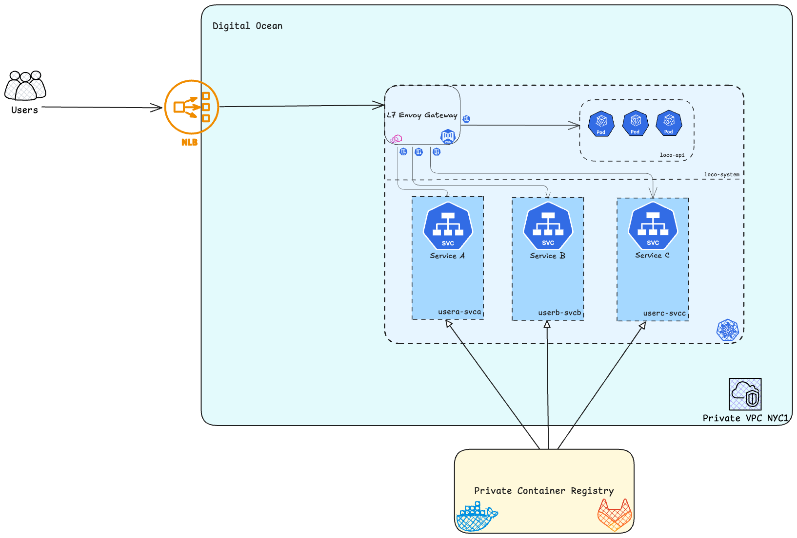

# 🚂 Loco

> Deploy containerized apps right from your terminal.

Loco is a container orchestration platform that simplifies application deployment. Run `loco deploy` and Loco handles the rest - building, deploying, and scaling your applications on Kubernetes.

## Features

- **One click deployments** - Deploy with just `loco deploy`
- **Automatic Builds** - Dockerfile-based container builds.
- **Auto-scaling** - Sensible CPU based horizontal scaling that can be easily configured.
- **HTTPS by default** - Automatic SSL certificate management, powered by Let's Encrypt and Certificate Manager.
- **Fast Reverse Proxy** - Envoy Gateway API serves HTTP3 traffic.
- **Simple Configuration** - Easy setup via `loco.toml`. A sample spec can be generated via `loco init`.

## Architecture Diagram



## Quick Start

1.  **Download the loco cli**

```bash
go install github.com/nikumar1206/loco@latest
```

2. **Run `loco init` to create a `loco.toml` file.**

3. **Deploy your app via `loco deploy`**

Your app will be available at `https://myapp.deploy-app.com`

See all loco cli commands via `loco help`.
Loco also generates completions for shells such as bash and zshrc.

```bash
loco completion zsh
```

## Examples

Sample [`loco.toml`](./loco.toml)

A very simple app (currently deployed on loco) can be found here: [example-test-api](./examples/test-api/)

## How-Tos

- how we can scale our clusters

## Abuse Prevention

To avoid abuse, Loco uses an invitation system. The repo collaborators is re-purposed as an invitation list and determines who can deploy with Loco.
You must first reach out to me, nikumar1206, if you would like to deploy on this platform.

## Documentation

To be added later.

## Contributing

To be added later.

---

**Note:** This project is primarily educational, created so I can learn more about Kubernetes, networking, and security.

“Engines warming up…”
“Switching tracks…”
“Pushing to the mainline…”
“Pods aligned. Ready for departure.”
